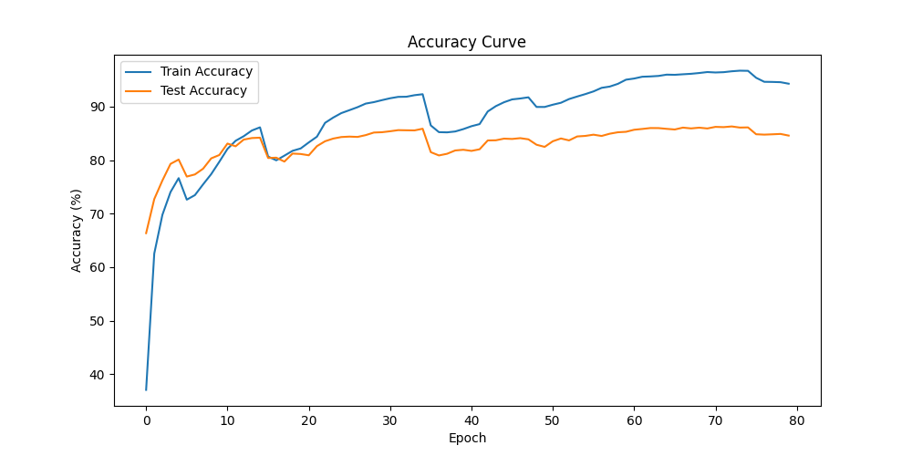
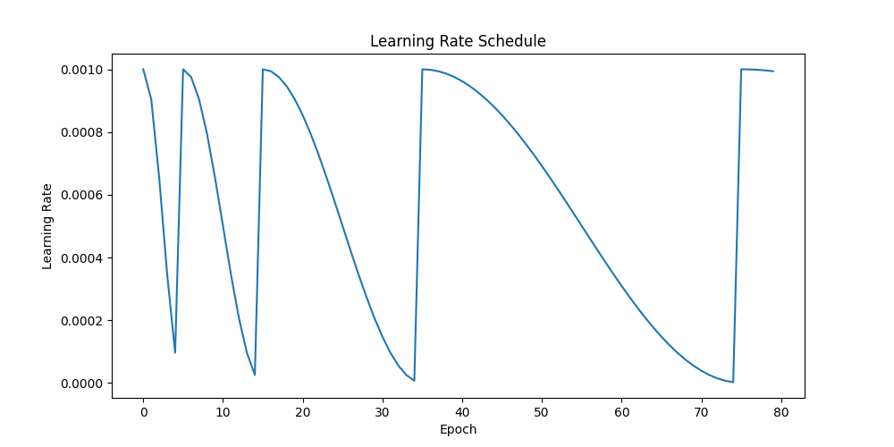

# EfficientNet-B0 CIFAR-100 Fine-tuning

A demonstration of deep learning model tuning skills using EfficientNet-B0 on CIFAR-100. This project focuses on practical implementation aspects and serves as a foundation for further experimentation in model optimization and edge deployment.

> **Note:** This project is intended as a practical demonstration and proof of concept. It is not designed for research or state-of-the-art benchmarking, but rather for educational and deployment-focused purposes.

**This project is licensed under the MIT License. See the LICENSE file for details.**

**Python Version:** 3.12+
- Please ensure you have Python 3.12 or newer installed. Some dependencies may not work with earlier versions.
- It is strongly recommended to use a [virtual environment](https://docs.python.org/3/tutorial/venv.html) to avoid conflicts with other Python packages.

**Key Dependencies:**
- torch
- torchvision
- thop
- ptflops
- psutil

See `requirements.txt` for the full list.

## 🎯 Project Goals

- Demonstrate practical deep learning model tuning skills
- Create a well-documented, production-ready implementation
- Establish a foundation for future work in:
  - Model distillation
  - Edge device deployment
  - Real-time inference optimization
- Focus on code quality and reproducibility over benchmark chasing
- **Not intended for research or SOTA benchmarking; results are for demonstration and practical use.**

## �� Results

- **Top-1 Accuracy**: 86.31% on CIFAR-100 test set
- **Model Size**: 
  - Core Weights: 16.15 MB
  - Full Checkpoint: ~29 MB (includes optimizer states, training metadata, and other components)
- **Training Time**: ~2 hours on a single Google Cloud T4 GPU (Times may vary depending on hardware).
- **Inference Time**: ~35-37 ms per image (batch size 1, measured on Apple M2 CPU; will vary on other hardware such as NVIDIA T4 GPU or Raspberry Pi). 
  - *Note: Inference times will vary significantly depending on your hardware. Expect faster times on modern NVIDIA GPUs and slower times on edge devices like Raspberry Pi or Jetson Nano.*




## 💡 Practical Applications

This implementation is particularly suitable for:
- Embedded device image classification
- Educational demonstrations
- Real-time vision tasks on:
  - Raspberry Pi
  - Jetson Nano
  - Other edge devices
- Transfer learning experiments
- Model optimization research

## ⚡ Efficiency Metrics

### ⚡ Model Efficiency

| Metric                | Value         |
|---------------------- |--------------|
| MACs (THOP)           | 413.99 M     |
| Params                | 4.14 M       |
| Inference Time (CPU)  | ~35-37 ms (batch size 1) |
| Model Size (core)     | 16.15 MB     |
| Model Size (checkpoint)| ~29 MB (includes optimizer states, training metadata, and other components) |
| Peak RAM Usage        | ~6.14 MB (CPU)|

> **MACs (THOP):** The number of Multiply-Accumulate operations required per inference.
> **Note:** All metrics measured on CPU (Apple M2) using PyTorch and THOP/ptflops libraries. Results may vary on different hardware (e.g., NVIDIA GPUs like T4, Raspberry Pi, Jetson Nano, etc.).

## 🛠️ Training Methodology

### Model Architecture
- Base model: EfficientNet-B0 (pretrained on ImageNet)
- Modified classifier for CIFAR-100 (100 classes)
- Dropout rate: 0.2 (for regularization)

### Data Augmentation
- Random Resized Crop (224x224)
- Random Horizontal Flip (p=0.5)
- Random Rotation (±15 degrees)
- Color Jitter (brightness, contrast, saturation)
- Random Erasing (p=0.4)
- Normalization using CIFAR-100 statistics

### Training Strategy
- **Learning Rate**: 0.001 with Cosine Annealing Warm Restarts
  - T_0: 5 epochs
  - T_mult: 2
  - Minimum LR: 1e-6
- **Optimizer**: AdamW
  - Weight decay: 1e-4
  - Beta1: 0.9
  - Beta2: 0.999
- **Loss Function**: Cross Entropy with Label Smoothing (0.1)
- **Batch Size**: 64
- **Gradient Accumulation**: 4 steps
- **Training Duration**: 80 epochs
- **Mixed Precision**: FP16 training

### Design Decisions
- Conservative learning rate schedule for stability
- Moderate data augmentation to prevent overfitting
- Focus on inference efficiency over maximum accuracy
- No aggressive optimization techniques to maintain code clarity

## 💻 Hardware Requirements

### Training Environment
- **GPU**: CUDA-compatible GPU (8GB+ VRAM)
- **CPU**: Any modern multi-core processor
- **RAM**: 16GB+ recommended
- **Storage**: ~10GB for dataset and checkpoints
- **OS**: Linux/Windows/macOS

### Inference Environment
- **CPU**: Any modern processor
- **RAM**: 1GB+ (366.56 MB peak usage)
- **Storage**: ~20MB for model weights
- **OS**: Any OS with Python support

## 🚀 Installation

1. Clone the repository:
```bash
git clone https://github.com/yourusername/efficientnet-cifar100-finetuning.git
cd efficientnet-cifar100-finetuning
```

2. (Recommended) Create and activate a virtual environment to avoid conflicts with other Python packages:
```bash
python3.12 -m venv venv
source venv/bin/activate  # On Windows: venv\Scripts\activate
```

3. Install dependencies (Python 3.12+ recommended):
```bash
pip install -r requirements.txt
```

**Key dependencies:** torch, torchvision, thop, ptflops, psutil

## 📊 Usage

### Training
```bash
python training/train_v1.py
```

The training script will:
- Download CIFAR-100 dataset automatically
- Initialize EfficientNet-B0 model
- Train for 80 epochs with automatic checkpointing
- Save training metrics and visualizations in the `results/train_v1` directory

### Efficiency Testing
```bash
python training/efficiency_test.py
```

This will evaluate:
- MACs and parameter count
- Inference time
- RAM usage
- Model size
- Results are saved to `results/efficiency_metrics/efficiency_metrics.txt`

## 📁 Project Structure

```
efficientnet-cifar100-finetuning/
├── data/               # CIFAR-100 dataset
├── results/           # Training results and checkpoints
│   └── train_v1/     # Training run results
│       ├── checkpoints/  # Model checkpoints
│       ├── metrics/      # Training metrics
│       ├── plots/        # Training visualizations (e.g., accuracy/loss curves, learning rate schedule)
│       └── logs/         # Training logs
├── training/          # Training code
│   ├── model.py      # Model and dataset implementation
│   ├── train_v1.py   # Training script
│   └── efficiency_test.py # Model efficiency testing
├── LICENSE           # MIT License
└── requirements.txt  # Project dependencies
```

*Check the `results/train_v1/` folder for training logs, checkpoints, and visualizations. For example:*
- `results/train_v1/plots/`: Visualizations of training curves and learning rates
- `results/train_v1/checkpoints/`: Saved model checkpoints
- `results/train_v1/logs/`: Training logs

## 🔮 Future Work

### Model Optimization
- **Model Quantization:** Using techniques such as Post-training Quantization (PTQ), we plan to convert the model weights from float32 to lower precision (like INT8 or FP16), reducing the model size and increasing inference speed without a significant loss in accuracy. Tools like [TensorRT](https://docs.nvidia.com/deeplearning/tensorrt/developer-guide/index.html) or [PyTorch Quantization](https://pytorch.org/docs/stable/quantization.html) can be used for this.
- **Knowledge Distillation:** To improve the performance of smaller models, we plan to investigate distillation where a larger "teacher" model helps train a smaller "student" model, resulting in reduced size with minimal accuracy sacrifice. See [PyTorch Knowledge Distillation Tutorial](https://pytorch.org/tutorials/intermediate/distiller.html).
- Pruning and compression
- Architecture modifications

### Deployment
- ONNX export
- TensorRT optimization
- TensorFlow Lite
- Mobile deployment
- Web deployment
- **Edge Device Deployment:** This model can be deployed to Raspberry Pi, Jetson Nano, or other edge devices by exporting the model to ONNX. For detailed instructions on how to export the model to ONNX, refer to the [ONNX Model Export and Deployment Guide](https://pytorch.org/tutorials/advanced/super_resolution_with_onnxruntime.html). You can use tools like TensorRT or TensorFlow Lite for further optimization.

### Training Improvements
- Advanced augmentation techniques
- Learning rate finder (e.g., [Optuna](https://optuna.org/), [Ray Tune](https://docs.ray.io/en/latest/tune/index.html), [Hyperopt](https://github.com/hyperopt/hyperopt))
- Hyperparameter optimization
- Cross-validation

## ⚠️ Troubleshooting

### Common Issues

**1. CUDA Out of Memory**
- Reduce batch size
- Enable gradient accumulation
- Use mixed precision training
- Refer to this [PyTorch Memory Management Guide](https://pytorch.org/docs/stable/notes/cuda.html) for more help.

**2. Slow Training**
- Check GPU utilization
- Optimize data loading
- Use appropriate batch size

**3. Poor Accuracy**
- Verify data preprocessing
- Check learning rate
- Monitor training curves

## 📝 License

This project is licensed under the MIT License - see the [LICENSE](LICENSE) file for details.

## 🤝 Contributing

Contributions are welcome! Please feel free to submit a Pull Request.

## 📚 References

- [EfficientNet: Rethinking Model Scaling for Convolutional Neural Networks](https://arxiv.org/abs/1905.11946)
- [CIFAR-100 Dataset](https://www.cs.toronto.edu/~kriz/cifar.html)
- [PyTorch Documentation](https://pytorch.org/docs/stable/index.html)
- [Mixed Precision Training](https://pytorch.org/docs/stable/notes/amp_examples.html)